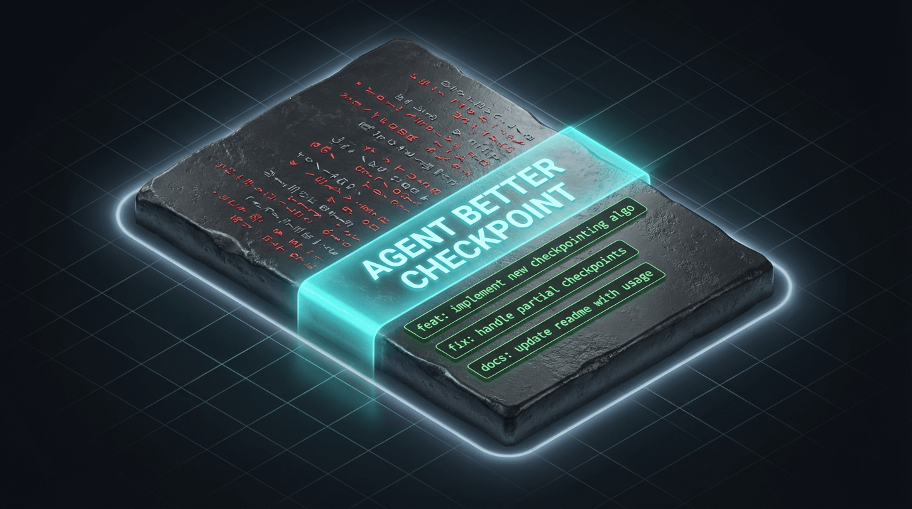

# Agent Better Checkpoint (ABC)

**One-line install, zero config.** Turns AI agent edits into transparent, queryable Git commits.

```bash
npx @vibe-x/agent-better-checkpoint
```



That's it. Your AI coding assistant (Cursor, Claude Code) will now auto-commit every meaningful edit with semantic messages and structured metadata — no more opaque checkpoints.

---

## The Problem

AI coding assistants create "checkpoints" as you work, but these are black-box snapshots:
- **Unreadable** — no meaningful commit messages
- **Unnavigable** — can't browse or diff individual changes
- **Unqueryable** — no way to filter, search, or trace back

## The Solution

Agent Better Checkpoint replaces them with real Git commits:

```
checkpoint(api): add user registration endpoint

Implement POST /api/users with email/password validation.
Includes bcrypt hashing and duplicate email check.

Agent: cursor
Checkpoint-Type: auto
User-Prompt: 帮我实现用户注册接口，需要邮...要密码加密
```

Each commit follows [Conventional Commits](https://www.conventionalcommits.org/) and carries structured metadata via [Git Trailers](https://git-scm.com/docs/git-interpret-trailers) — queryable with standard Git tools:

```bash
git log --grep="^checkpoint("                          # all checkpoints
git log --format="%(trailers:key=Agent,valueonly)"     # by agent
git log --grep="User-Prompt:.*registration"            # by prompt keyword
```

### Works with Your Favorite Git Tools

Since every checkpoint is a standard Git commit, the entire Git ecosystem is at your disposal — what was once a hidden, platform-specific checkpoint becomes a first-class citizen you can browse, search, diff, and rebase.

| Tool | Type | What You Get |
|------|------|-------------|
| [GitLens](https://marketplace.visualstudio.com/items?itemName=eamodio.gitlens) | VS Code / Cursor Extension | Inline blame, file history, visual commit graph, interactive rebase — see *who* (you or the AI) changed *what* and *when*, right in the editor |
| [lazygit](https://github.com/jesseduffield/lazygit) | Terminal UI | Fast keyboard-driven staging, diff browsing, cherry-pick, and rebase across checkpoint commits |
| [tig](https://github.com/jonas/tig) | Terminal UI | Lightweight ncurses Git log viewer, great for quickly scanning checkpoint history |
| [GitHub / GitLab Web UI](https://github.com) | Web | Browse, compare, and share checkpoint history online after pushing |

For example, with **GitLens in Cursor** you can hover any line to see which checkpoint introduced it and the original user prompt, view all checkpoints for a file in a timeline, or search commits by `checkpoint(` prefix and `User-Prompt` trailer content.

---

## How It Works

Three components, fully automatic after install:

| Component | What it does |
|-----------|-------------|
| **SKILL.md** | Instructs the AI to commit after each meaningful edit, with proper format |
| **Commit Script** | Appends Git Trailers (agent, type, user prompt) and runs `git commit` |
| **Stop Hook** | Safety net — reminds the AI to commit if anything is left uncommitted |

```
User gives task → AI edits code → AI calls checkpoint script → Git commit with trailers
                                                              ↗
                              Conversation ends → Stop hook checks for uncommitted changes
```

---

## Installation

### Prerequisites

- Git ≥ 2.0
- Node.js ≥ 18 (only needed for installation)
- [Cursor](https://cursor.com) or [Claude Code](https://docs.anthropic.com/en/docs/claude-code)

### Quick Install

```bash
npx @vibe-x/agent-better-checkpoint
```

Auto-detects your OS and AI platform. Or specify explicitly:

```bash
npx @vibe-x/agent-better-checkpoint --platform cursor
npx @vibe-x/agent-better-checkpoint --platform claude
```

### Project-local Install

Install scripts into your project for self-contained setup (commit with repo):

```bash
cd /path/to/your/project
npx @vibe-x/agent-better-checkpoint --project-local
```

Or specify a target directory:

```bash
npx @vibe-x/agent-better-checkpoint --dir /path/to/your/project
```

Uninstall project-local only:

```bash
npx @vibe-x/agent-better-checkpoint --uninstall --project-local
npx @vibe-x/agent-better-checkpoint --uninstall --dir /path/to/project
```

### Via [skills.sh](https://skills.sh)

```bash
npx skills add alienzhou/agent-better-checkpoint
```

The AI agent will auto-bootstrap the runtime scripts on first use.

### What Gets Installed

| Location | Content |
|----------|---------|
| `~/.vibe-x/agent-better-checkpoint/scripts/` | Commit script (`checkpoint.sh` / `.ps1`) |
| `~/.vibe-x/agent-better-checkpoint/hooks/stop/` | Stop hook (`check_uncommitted.sh` / `.ps1`) |
| Platform skill directory | `SKILL.md` — AI agent instructions |
| Platform hook config | Stop hook registration |

> **Project-local mode**: Projects can also commit `.vibe-x/agent-better-checkpoint/` (config + scripts) for self-contained setup. When present, the global hook delegates to the project-local scripts automatically.

### Uninstall

```bash
npx @vibe-x/agent-better-checkpoint --uninstall
```

---

## Platform Support

| Platform | OS | Status |
|----------|----|--------|
| Cursor | macOS, Linux, Windows | ✅ |
| Claude Code | macOS, Linux, Windows | ✅ |

---

## Contributing

See [CONTRIBUTING.md](CONTRIBUTING.md) for development setup, testing, and publishing instructions.

## License

[MIT](LICENSE)
